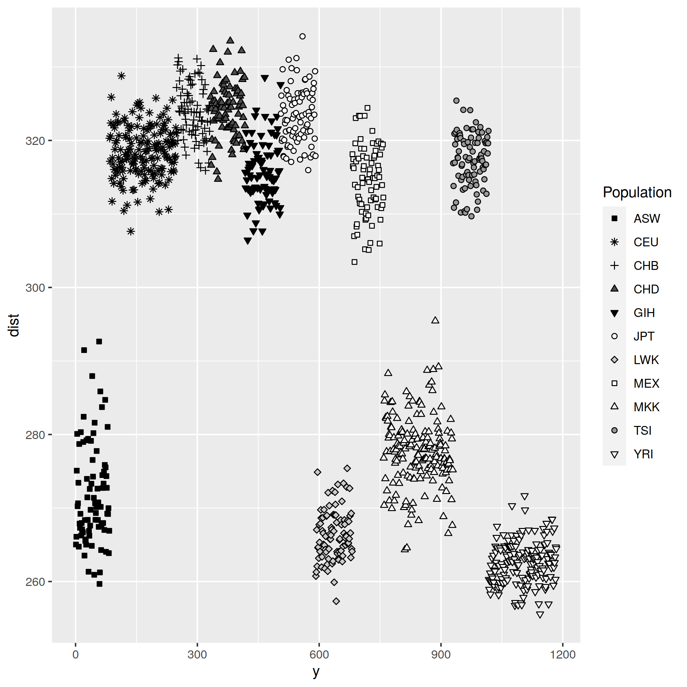
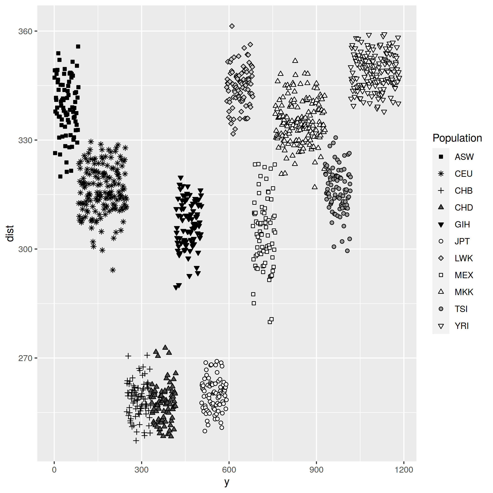
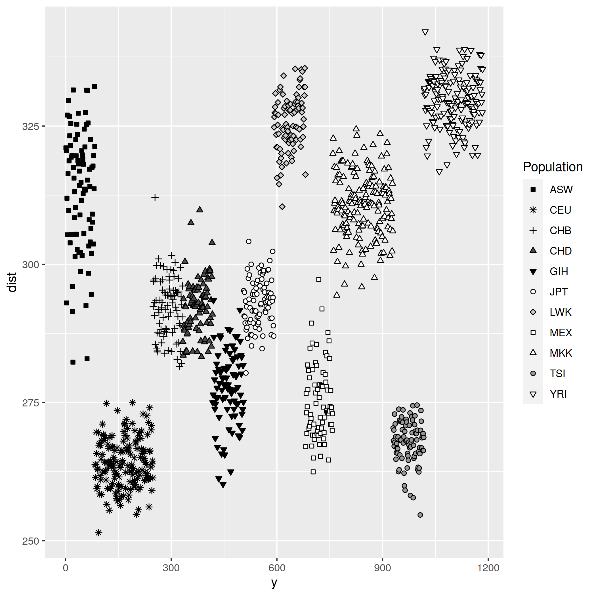

# Distance from reference example

This example demonstrates the effects of using different reference populations on QGS values. The example uses public HapMap3 and 1000G data to compute the total genetic distance on chromosome 2 from three different reference populations.

The script demonstrates how to 

1. perform a lift to ensure that the sample and reference share the same mapping/build;
2. extract different population references from 1000G;
3. calculate QGS using different references;
4. plot the QGS sum total per individual in R.

The populations and abbreviations can be found [here for HM3](https://www.sanger.ac.uk/resources/downloads/human/hapmap3.html) and [here for 1000G](https://www.internationalgenome.org/category/phenotype/).

The script assumes that `python2`, [`Plink`](http://zzz.bwh.harvard.edu/plink/), [`Bcftools`](https://samtools.github.io/bcftools/), and `QGS` are installed and in your executable search path.

The Linux shell script `qgs_distance.sh` downloads, extracts, lifts and converts the HM3 data, downloads the 1000G chromosome 2 data and extracts three distinct population references, runs QGS, and runs R to create plots.

The R script `qgs_distance.R` calculates QGS sum totals for each HM3 individual and plots these.

The `plots/` directory contains the six png output plots of the script.

## Esan in Nigeria (ESN) results

For the ESN plots, the Esan in Nigeria population has been used as a reference. As a result, we can see that the Yoruba in Ibadan, Nigeria (YRI) population has the smallest genetic distance from this reference population.

Other groups with a relatively small genetic distance from ESN are the African ancestry in Southwest USA (ASW), Luhya in Webuye, Kenya (LWK), and Maasai in Kinyawa, Kenya (MKK) groups.

## Southern Han Chinese (CHS) results

For the CHS plots, the Southern Han Chinese population has been used as a reference. The groups with the smallest genetic distance from CHS are the Han Chinese in Beijing, China (CHB), Chinese in Metropolitan Denver, Colorado (CHD), and Japanese in Tokyo, Japan (JPT) groups.

## Finnish in Finland (FIN) results

For the FIN plots, the Finnish in Finland population has been used as a reference. The groups with the smallest genetic distance from FIN are the Utah residents with Northern and Western European ancestry from the CEPH collection (CEU) and the Toscani in Italia (TSI).